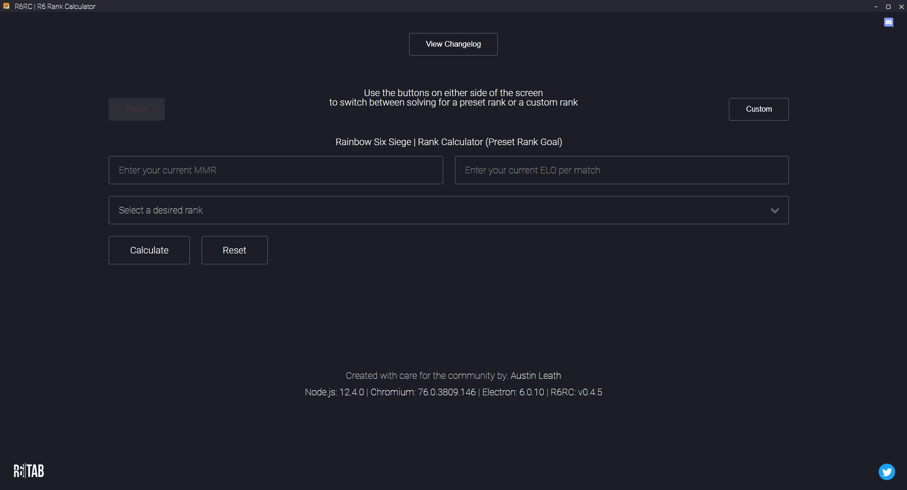
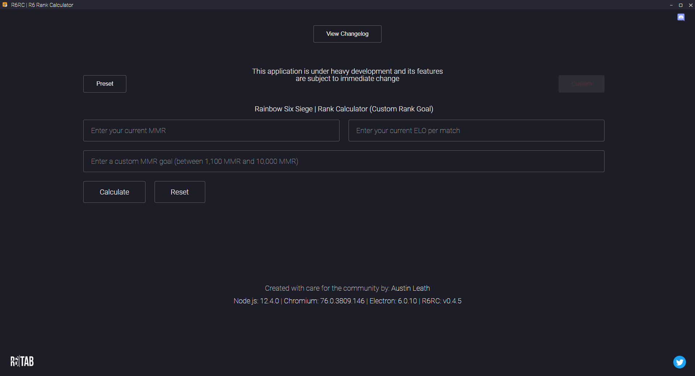

  
  <h1 align="center">R6RC | R6 Rank Calculator</h3>
  

    
    = 
      
      
  

  

    
    
    
  

## Description
- The R6RC | R6 Rank Calculator takes a user's current MMR (Match Making Rating) and ELO (Points per match) to display how many matches the user has to win or lose to reach their goal.

## Download
- **You can find releases <u>[here](https://www.github.com/austinleath/mmrcalculator/releases)**</u>

## Features
- Solve for a <i>preset</i> goal (see <u>[points chart](https://github.com/AustinLeath/mmrcalculator/blob/master/assets/images/ranks.jpg)</u>)
- Solve for <i>custom</i> goal (anywhere between 1,300 & 10,000)
- Calculate how many games you have to <i>**win**</i> to reach your rank goal
- Calculate how many games you have to <i>**lose**</i> to reach your rank goal
- Switch between solving for preset and custom values
- Automatic updates
- Clean UI

## Platforms
- This app is currently only supported on all **Windows** platforms

## Pictures
 
 

## Affiliation
- The R6RC | R6 Rank Calculator is in no way shape or form affiliated with Ubisoft and its partners. Any "Rainbow Six: Siege" name, logos and/or images are registered trademarks of Ubisoft.

## License
MIT © <u>[AustinLeath](https://github.com/AustinLeath/mmrcalculator/blob/master/LICENSE)</u>
